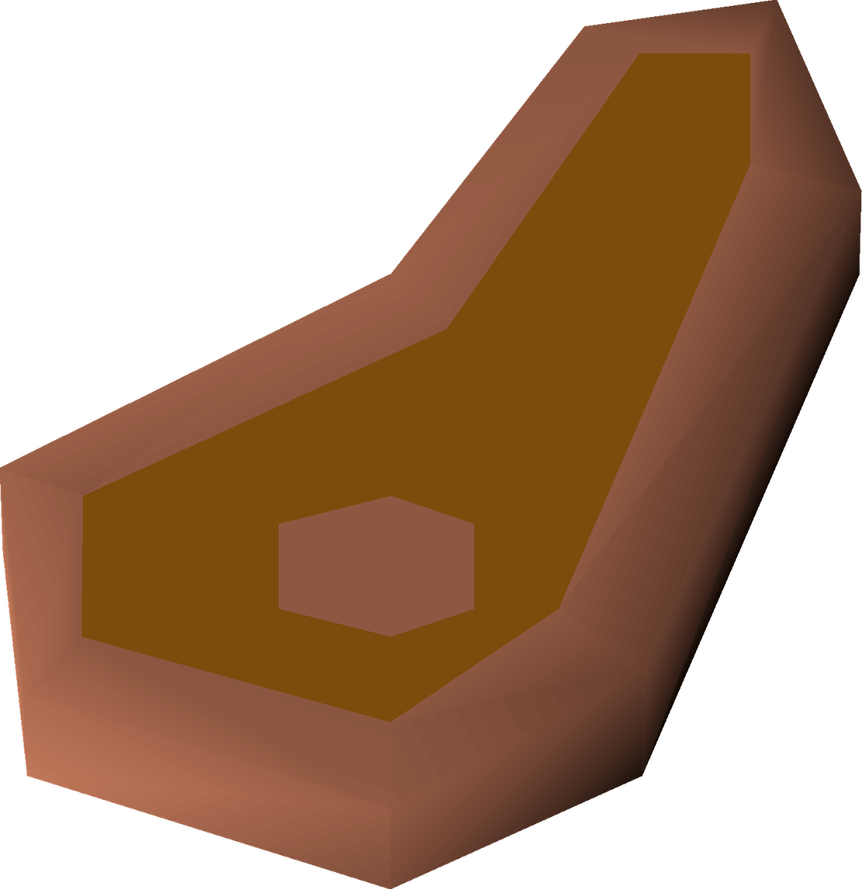
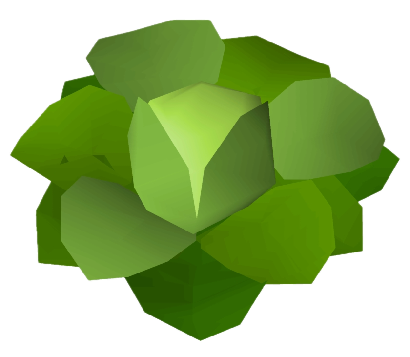
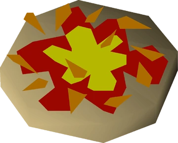

#  Dom's Recipes Repo!

A collection of my favourite and custom recipes

Split between savoury/sweet and then by type of food and ingredients!

---

## Index

### Savoury

####  Meat Dishes
- [Bolognese](savoury/Bolognese.md) - Classic pasta sauce with minced beef
- [Gochujang Pork Belly](savoury/Gochujang-Pork-Belly.md) - Air-fried pork belly with spicy gochujang glaze
- [Chicken Fajitas](savoury/Chicken-Fajitas.md) - Pan-fried chicken fajitas with vegetables

####  Pasta Dishes
- [Carbonara](savoury/Carbonara.md) - Creamy egg and bacon pasta

####  Vegetable Dishes
- [Stuffed Peppers](savoury/Stuffed-Peppers.md) - Bell peppers stuffed with rice and chicken

####  Pizza Dishes
- [Tortilla Pizza](savoury/Tortilla-Pizza.md) - Quick tortilla pizzas with pepperoni and jalapeños

---

### Sweet

####  Cookies & Bakes
- [Dom's Cookies](sweet/Doms-Cookies.md) - Chocolate chunk cookies with milk and dark chocolate

####  Pancakes
- [Pancakes](sweet/Pancakes.md) - *Recipe template - add your pancake recipe*

#### Desserts
- [Sea Salt Nutella Fudge](sweet/Sea-Salt-Nutella-Fudge.md) - Rich fudge with Nutella and sea salt topping

---

## Recipe Template

Need to add a new recipe? Use the [template.md](template.md) as a starting point!

